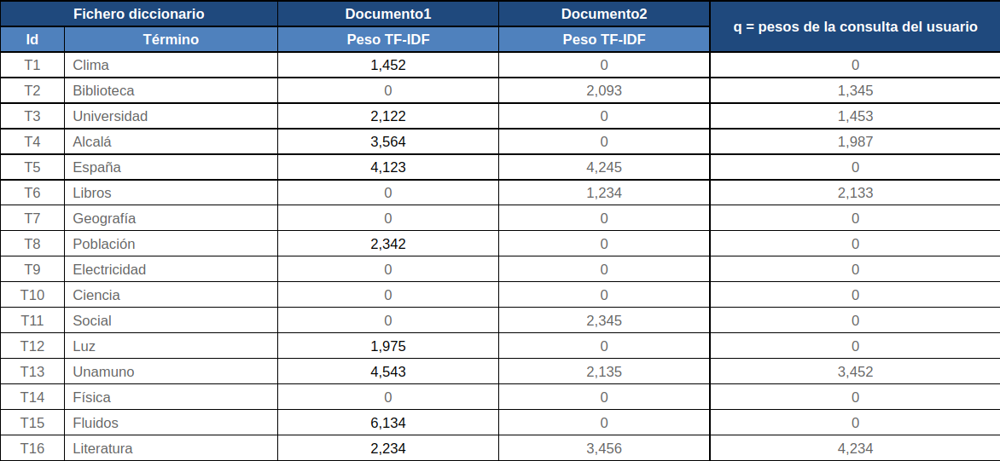
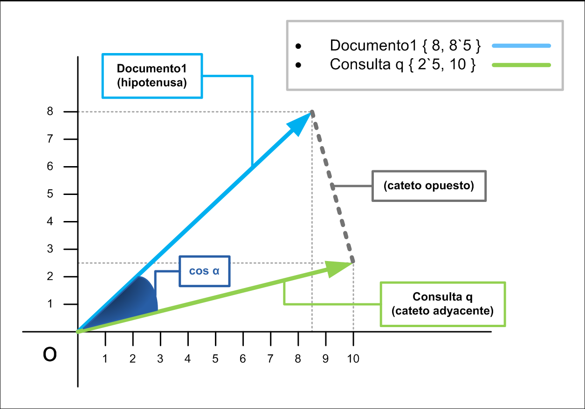
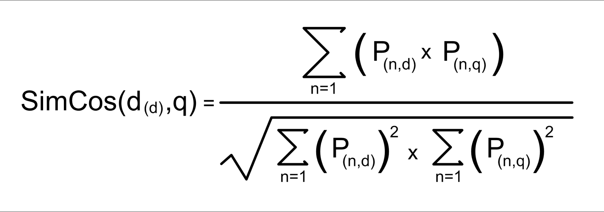
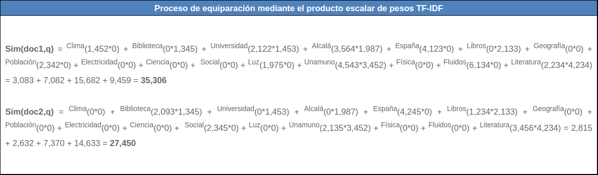
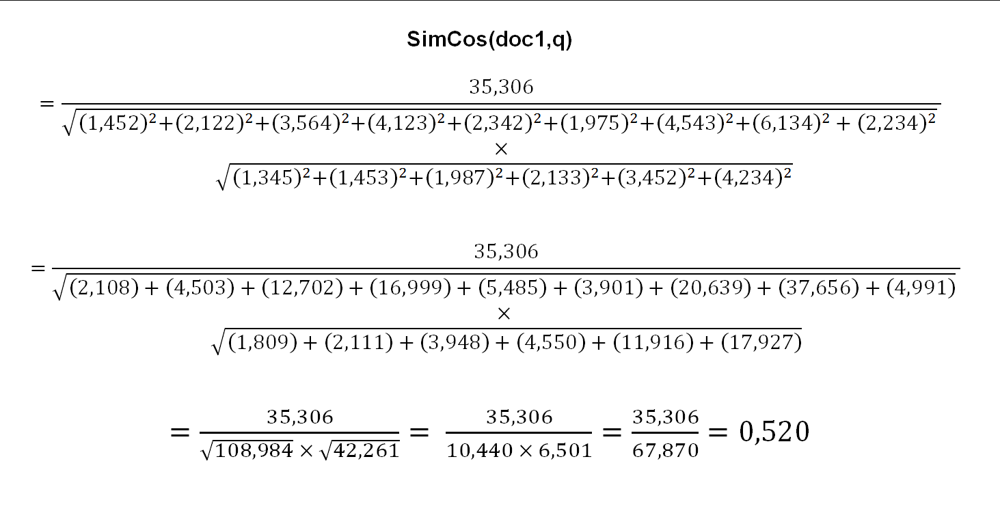
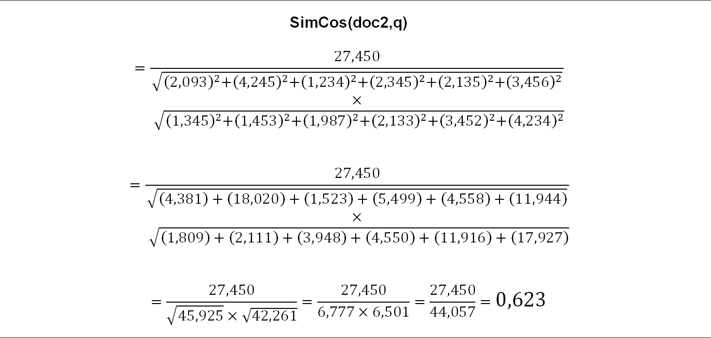

# Proyecto Moogle! Mauro Eduardo Campver Barrios C-112

Moogle es un motor de búsqueda desarrollado con el objetivo de emparejar una query con los documentos relacionados a esta de una forma u otra. Se implementó un modelo vectorial en el cual se representan los pesos(Tf-Idf) de las palabras presentes en cada documento, quedando un vector por documento que luego será comparado a con el vector de la query a través de la similitud del coseno. Este proceso arroja un score por documento, posteriormente se organiza de forma descendente, premiando a los documentos con más puntuación.

---
## Clases
* ***Corpus*** 
  * ProcessQuery
  * FillTFIDFMatrix
  * Operadores:
     * ThereIsNotSkipWordInDocument(!)
     * ThereIsForceWordInDocument(^)
     * Cercania(~)
  * ProcessScore
  * Snippet
  * GetScore
  * LevenshteinSimilarity
   
* ***Document***
    * FillDictionarys
* ***Moogle***
* ***Query***
    * Normalización de la Query
    * Filtrado de los operadores
* ***Synonyms***


# ***[Corpus](https://github.com/Mauro-02/Moogle240722Final/blob/5dab749c342e9c04bdcbe0244181cdd3826cec7a/moogle-main/MoogleEngine/Corpus.cs)***

Aquí se desarrollan la gran mayoría de los procesos del proyecto, es la clase principal del Proyecto, manipula los atributos para los Documentos y Query. Cuando se ejecuta el constructor de la clase, esta comprueba la existencia de la carpeta Content, y la existencia de archivos .txt dentro de esta, realiza el procesado de los documentos a través de la clase Document, y llena la matriz tf-idf que contendrá la relación del peso de cada palabra en los documentos que la contienen.

Dentro de esta clase hay que destacar varios métodos, se enumeraran a continuación y se dará una breve explicación de su función.

* ProcessQuery
>Se encarga del procesado de la query, es un método Boolean, ya que varía su ejecución si es la 1ra vez que se ejecuta(sería verdadero) o no(falso).
``` c#
  public void ProcessQuery(Boolean originalquery)
    {
        if (originalquery)
        {
            query = new Query(this.inputquery); // Procesa Query Original
            if (query.Error != 0) // se encontró un error en el procesamienro de la query
            {
                error = query.Error;
                return;
            }
        }
        else
        {
            query = new Query(this.suggestions);
        }

        tfidfqueryvector = new float[vocabulary.Count]; // crea el objeto tfidfqueryvector
        FillVectorTFIDFQuery(); //  Calcula el vector tfidf de la query
    }
```
* FillTFIDFMatrix()
>Se encarga del llenado de la matriz tfidf que relaciona los documentos con las palabras de este y su peso. El tf-idf forma parte del modelo vectorial. El Tf se calcula a través del método *GetTF*, su explicación breve sería la división del número de ocurrencias de la palabra en el documento / total palabras en el documento, si la palabra no está en el Documento, entonces tf=0f. El Idf sería el log base10(cantidad de documentos en el corpus / cantidad de documentos que contienen la palabra).
```c#
public void FillTFIDFMatrix()
    {
        tfidfmatrix = new float[docs.Length, vocabulary.Count]; // filas=Docs, Col= Palabras. Dimension = cant de doc x cant de palabras del Vocabulario

        for (int i = 0; i < docs.Length; i++)
        {
            int index = 0;
            foreach (var aux in vocabulary.Keys) // calcula TF-IDF de cada palabra en el vocabulario
            {   
                tfidfmatrix[i, index++] =
                    GetTF(docs[i], aux)
                    * (float)Math.Log10((float)docs.Length / (float)vocabulary[aux]);
            }
        }
    }
```
>A continuación un ejemplo de como pudiera quedar una matriz de este estilo:



* **Operadores**:

El proyecto cuenta con 4 operadores principales, en esta clase se desarrollan 3 de ellos:  
* ThereIsNotSkipWordInDocument(!)
 >  Averigua si hay alguna palabra de la Query con el Signo !, si existe alguna palabra con !, la busca en el diccionario del Documento, si existe, el Documento no clasifica y retorna False, si todas las palabras con !, no están en el Documento, el Documento clasifica y retorna True, también retorna True, si ninguna palabra de la Query tiene el Operador !.
```c#
    private Boolean ThereIsNotSkipWordInDocument(int docindex)
    {
        foreach (var item in query.Querydictionary.Keys) // Recorre el Dicc de Query buscando las palabras con !
        {
            if (query.Querydictionary[item][3] != 0) // Si la Pos. 3 es distinta de cero esa palagra hay q omitirla
            {
                if (docs[docindex].Docsdictionary.ContainsKey(item)) // La palabra con !, esta en el Documento. El Documento no clasifica.
                    return false;
            }
        }

        return true;
    }

```

* ThereIsForceWordInDocument(^)
>    Averigua si hay alguna palabra de la Query con el Signo ^, si existe alguna palabra con ^, la busca en el Diccionario del Documento, si no existe, el Documento no clasifica y retorna False, si todas las palabras con ^, están en el Documento, el documento clasifica y retorna True, también Retorna True, si ninguna palabra de la Query tiene el Operador ^.

```c#
    private Boolean ThereIsForceWordInDocument(int docindex)
    {
        foreach (var item in query.Querydictionary.Keys) // Recorre el Dicc de Query buscando las palabras con ^
        {
            if (query.Querydictionary[item][2] != 0) // Si la Pos. 2 es distinta de cero esa palagra tiene q estar en el Documento
            {
                if (!(docs[docindex].Docsdictionary.ContainsKey(item))) // La palabra con ^, no esta en el Documento
                    return false;
            }
        }

        return true;
    }
```

* Cercanía(~)
>  Determina la distancia mínima entre las palabras de la Query con el Operador de Cercanía (~) en el Documento, pasado como parámetro. Todos los Documentos que llegan aquí, ya han clasificado con score 0 y superado las condiciones de los Operadores ! y ^. Los conceptos Score y Cercanía, son inversamente proporcionales, si Cercanía es pequeña el Score aumenta. Para esto se calcula la cercanía mínima entre todas las parejas de palabras que existan en los Documentos: si alguna palabra no aparece en el Documento, se continúa con el análisis de las otras parejas; si no hay palabras afectadas con el Operador de Cercanía, como Distancia retorna 1(con lo que no se afecta el Score del Documento); si hay varias parejas de palabras, parece justo devolver la distancia mínima obtenida, así se premia al documento; si hay más parejas de palabras que no existen en el Documento, se retorna como distancia la cantidad de palabras del Documento.

```c#
private int Cercania(int docindex)
    {
        string word2;
        int near = docs[docindex].Wordcount;
        int nearaux;
        int cnearsindoc = 0; // Cuenta las parejas de cercanas en el Documento
        int cnearsnotindoc = 0; // Cuenta las Parejas de Cercanas que no estan en el Documento
        List<string> wordlist = new List<string>();

        foreach (string word1 in query.Cercanas.Keys) // Por cada palabra key en el Diccionario Cercanas
        {
            wordlist = query.Cercanas[word1]; // en worlist la lista de palabras cercanas a word1
            for (int i = 0; i < wordlist.Count; i++) // Recorre la lista de palabras cercanas a word1
            {
                word2 = wordlist.ElementAt(i); // En word2 la palabra cercana a word1
                if (
                    docs[docindex].Docsdictionary.ContainsKey(word1)
                    && docs[docindex].Docsdictionary.ContainsKey(word2)
                ) // Las dos palabras con ~, estan en el Documento.
                {
                    nearaux = DistanciaMinima(word1, word2, docindex);
                    if (nearaux == 0)
                        cnearsnotindoc++; // las palabras cercanas son iguales y aparece una sola vez
                    else if (nearaux < near) // La distancia encontrada es menor que la que existia
                    {
                        near = nearaux; // en near queda la distancia minima entre todos los pares de palabras que estan en el Documento
                        cnearsindoc++;
                    }
                }
                else
                    cnearsnotindoc++; // Al menos una de las palabras no esta en el Documento, Se cuenta y se continua
            }
        }

        if (cnearsindoc > cnearsnotindoc)
            return near; // El Documento contiene mayoria de las palabras enlazadas y se retorna la minima distancia entre ellas
        else
            return docs[docindex].Wordcount; // El Documento contiene la minoria de las palabras, sera penalizado su score.
    }

```

* ProcessScore
>Para cada Documento, calcula su Score y si cumple las condiciones de elegibilidad( *ThereIsNotSkipWordInDocument* y *ThereIsForceWordInDocument* ) y se agrega a la lista SearchItem junto al título del documento, el Snippet y la última fecha de edición.
```c#
   public List<SearchItem> ProcessScore()
    {
        List<SearchItem> sitem = new List<SearchItem>();
        float score = 0f;

        for (int i = 0; i < docs.Length; i++)
        {
            score = GetScore(i); // Calcula Score de Cada Documento. Pasa como parametro el No. del Documento

            if ((score > 0) && ThereIsNotSkipWordInDocument(i) && ThereIsForceWordInDocument(i)) // El Documento Clasifica para ser mostrado, tiene score > 0, no contiene palabras a Omitir y contine las Obligadas.
            {
                if (query.Cercanas.Count != 0)
                    score = score / (float)Cercania(i); // en la Query existe el Operador ~, e influira en el Score del Documento
                
                    docs[i].Score = score;
                    Docs[i].Filesnippet = Snippet(Docs[i].Text, query.Palabras);
                    sitem.Add(new SearchItem(Docs[i].Filename, Docs[i].Filesnippet, docs[i].Score, docs[i].Dt));
                
            }
        }

        return sitem;
    }
```
    
* Snippet
>En este punto, el documento a analizar tiene una cierta relación con la Query, por lo que al menos una palabra de esta se encuentra en el documento. Lo primero que comprueba es el tamaño del documento, si posee menos de 500 caracteres se devuelve el mismo documento sin recortarlo Se recorre la Query comprobando una por una la existencia de esta en el documento, luego se extrae un Substring del documento a partir de la posición de la 1ra palabra encontrada. Si este string tiene más de 500 caracteres se extrae un Substring de este desde el inicio hasta 500 caracteres a la derecha, si no se devuelve completo.
```c#
    private string Snippet(string text, List<string> words)
    {
        string result = "";
        string word = " ";
        if(text.Length<500) return result=text;
        for (int i = 0; i < words.Count; i++)
        {
            if (text.Contains(" " + words[i] + " "))
            {
                word = " " + words[i] + " ";
                break;
            }
        }
        result = text.Substring(text.IndexOf(word));
        result = result.Length >= 500 ? result.Substring(0, 500) : result.Substring(0, result.Length);
        return result;
    }
```
* GetScore
>   Calcula el Score del documento pasado como parámetro, para ello se basa en el cálculo del Coeficiente de Similaridad del Coseno, para el cálculo se usan los valores de la matriz-tfidf y el queryvector-tfidf. El numerador es un producto escalar entre los pesos del documento y la consulta; y el denominador la raíz cuadrada del producto del sumatorio de los pesos del documento y la consulta al cuadrado. La formulación del denominador con raíz cuadrada y cálculo de cuadrados, se diseñó para conseguir un resultado final de la división, inferior a 1, de tal manera que el coeficiente fuera de fácil manejo y lectura.


```c#
public float GetScore(int docnumber)
    {
        float similaridadprodescalar = 0f; // Suma de los productos de cada elemento de la matriz-tfidf asociada al documento docnumber y los elementos del vector tfidfquery

        float matrizsquaresum = 0f; // Suma del cuadrado de cada elemento de la matriz-tfidf asociada al documento docnumber

        float vectorsquaresum = 0f; // suma del cuadrado de los elemntos del vector tfidf

        float similaridadcoseno = 0f; // similaridadprodescalar / ((raizcuadrada(matrizsquaresum)) * (raizcuadrada(vectorsquaresum)))

        for (int i = 0; i < vocabulary.Count; i++)
        {
            similaridadprodescalar += tfidfmatrix[docnumber, i] * tfidfqueryvector[i]; // Similaridad por el producto escalar del vector query y la Fila de la matriz-tfidf del documento docnumber

            matrizsquaresum += (float)Math.Pow(tfidfmatrix[docnumber, i], 2); // Suma del cuadrado de cada elemento de la matriz-tfidf asociada al documento docnumber
            vectorsquaresum += (float)Math.Pow(tfidfqueryvector[i], 2); // suma del cuadrado de los elemntos del vector tfidf
        }

        float deno = (float)((float)Math.Sqrt(matrizsquaresum) * (float)Math.Sqrt(vectorsquaresum));
        if (deno != 0f)
            similaridadcoseno = (float)similaridadprodescalar / deno;
        return similaridadcoseno;
    }
```
>Siguiendo los datos de la matriz mostrada más arriba (*Matriz_Tf-Idf*) podemos calcular la *similaridelcoseno* como se muestra a continuaciÓn:



>La *similaridadprodescalar*  de cada documento sería:



>Quedando así la *similaridelcoseno*  de cada documento:





* LevenshteinSimilarity
>Calcula la distancia entre dos cadenas y devuelve la similitud entre ellas. Para ello normaliza la distancia, dividiéndola entre la longitud de la cadena mayor (se obtiene un valor entre 0  y 1). Valores de la distancia Normalizada cercanos a 0, corresponde a cadenas semejantes. Finalmente la similitud entre dos cadenas, puede verse como el inverso de la distancia normalizada. Cuando la distancia Normalizada es pequeña la similitud es grande, por tanto se define que: sim(c1,c2) = 1 - DNorm(c1,c2).

```c#
  private float LevenshteinSimilarity(string wordvoc, string wordquery)
    {
        int dist = 0;
        int m = wordvoc.Length;
        int n = wordquery.Length;
        int[,] d = new int[m + 1, n + 1];
        if ((n == 0) || (m == 0))
            return 0f; // si una de las cadenas es vacia => Similitud 0

        for (int i = 0; i <= m; i++)
        {
            d[i, 0] = i;
        }
        for (int j = 0; j <= n; j++)
        {
            d[0, j] = j;
        }

        for (int i = 1; i <= m; i++)
        {
            for (int j = 1; j <= n; j++)
            {
                dist = (wordvoc[i - 1] == wordquery[j - 1]) ? 0 : 1;
                d[i, j] = Math.Min(
                    Math.Min(d[i - 1, j] + 1, d[i, j - 1] + 1),
                    d[i - 1, j - 1] + dist
                );
            }
        }

        float distNorm = m > n ? ((float)d[m, n] / (float)m) : ((float)d[m, n] / (float)n); // Normaliza la Distancia
        return 1 - distNorm;
    }
```
# ***[Document](https://github.com/Mauro-02/Moogle240722Final/blob/9ef82afdbf9aa1ae5992096a7156b3a5f2aa78ec/moogle-main/MoogleEngine/Document.cs)***

Esta clase se encarga del almacenamiento de los documentos y su normalización, su constructor recibe como parámetro de entrada: Camino y Nombre del Fichero a Procesar, lee el contenido del Fichero en una String, llama al Método *FillDictionarys* para llenar el Diccionario docsdictionary, le da valores a las variables wordcount, filename, filesnippet y filepath, a la variable filename, se le agrega la fecha de Modificación del fichero y se muestra en el resultado de la búsqueda.

* FillDictionarys
>Llena el Diccionario docsdictionary con las palabras del Documento, los parámetro de entrada son: Diccionario de Doc a llenar, una string con todas las palabras del Documento y el Diccionario Vocabulario. Después de procesado el último Documento, se ha llenado el Vocabulario del Corpus con todas las palabras (key) y como valor la cantidad de documentos que contienen la palabra.
```c#
    private int FillDictionarys(
        Dictionary<string, List<int>> dictionary,
        string textread,
        Dictionary<string, int> v
    ) //textread: Contenido leido desde los Ficheros
    {
        this.text = " "+ Regex.Replace(textread,"[^a-zA-Z0-9_áéíóúñ]", " ") //reemplaza todo lo que no sea letra o numero por un espacio
            .Replace('á', 'a')
            .Replace('é', 'e')
            .Replace('í', 'i')
            .Replace('ó', 'o')
            .Replace('ú', 'u')+" ";
            var words=text.Trim().Split(" ", StringSplitOptions.RemoveEmptyEntries); // En words, las palabras separadas por espacio. Las palabras quedan sin acentos
        

        for (int i = 0; i < words.Length; i++) // Ciclo para Obtener cada palabra
        {
            if (dictionary.ContainsKey(words[i])) //comprobar si el diccionario de Documentos contiene la palabra, si la tiene agrego un nuevo elemento a la lista con la posicion de la palabra
            {
                dictionary[words[i]].Add(i);
            }
            else
            {
                dictionary.Add(words[i], new List<int> { i }); // Si la palabra no existe en el Dic de Doc., se agrega como Key y se agrega un elemento a la lista con la posicion

                if (v.ContainsKey(words[i])) //si la palabra ya esta en Vocabulario del Corpus, se incrementa en uno, para contar que existe en ese Documento
                {
                    v[words[i]]++;
                }
                else
                {
                    v.Add(words[i], 1); // agrego la palabra al vocabulario e inicializo el contador en 1
                }
            }
        }

        return words.Length;
    }

```
   

# ***[Moogle](https://github.com/Mauro-02/Moogle240722Final/blob/18014439a5de6e7cad86da7ae843756e34d4332c/moogle-main/MoogleEngine/Moogle.cs)***
 >En esta clase se inicia el constructor de la clase *Corpus* y se recibe la Query desde el servidor. Se hacen una serie de comprobaciones para asegurar que no haya errores relacionados con los documentos o la Query. Se ejecuta el método *ProcessScore* y los resultados se ordenan descendentemente guardando solamente los 15 primeros. A continuación se busca una sugerencia a la Query con el método *FindSuggestion*. Si la cantidad de documentos devueltos es menor a 15, se buscaran sinónimos de la Query para intentar aumentar la cantidad de documentos devueltos.

# ***[Query](https://github.com/Mauro-02/Moogle240722Final/blob/f8492faf8c9cfdfef421e193091fd34b61a0e3ea/moogle-main/MoogleEngine/Query.cs)***

En esta clase se procesa la Query, se normaliza y se hace una serie de procedimientos para la detección de los operadores, se hace un barrido de los elementos de la Query y los clasifica en Tokens, según la clasificación definida por el enum token:
```c#
    private enum token
    {
        Importancia,
        Cercania,
        Obligacion,
        Omitir,
        ImpObli,
        Palabra,
        Ninguno
    };
```
>Esto permite identificar a que operador le corresponde cada palabra.

En el diccionario *querydictionary* se almacena información de las palabras de la Query, estas serán los Key y los valores, un arreglo de 4 elementos, usados de la siguiente manera:
*    (0): Cantidad de veces de la palabra en la query.
*    (1): Operador Importancia, =0 no existen *, !=0 cantidad de *.
*    (2): Operador Obligación, =0 no existe ^, !=0 existe ^.
*    (3): Operador Omitir, =0 no existe !, !=0 existe !.

>El operador de Importancia (*) se analiza cuando se está obteniendo el tfidf de la Query, el Tf de la palabra se multiplicará por 1.5f por cada operador (*) que tenga esa palabra.
```c#
 public float GetTFQuery(string word)
    {
        float auxtf = 0f;
        if (querydictionary.ContainsKey(word)) //la palabra del Vocabulario (pasada como parametro) esta en el Diccionario de La Query
        {
            auxtf = (float)querydictionary[word][0] / (float)wordquerycount; // en [0], esta la cantidad de veces q aparece la palabra en la Query
            if (querydictionary[word][1] != 0)
                auxtf = (float)auxtf * (float)querydictionary[word][1] * 1.5f; // si pos [1] !=0 esa palabra tenia *, y el valor es la cantidad de *
        }

        return auxtf; //en otro caso devuelvo 0
    }
```

# ***[Synonyms](https://github.com/Mauro-02/Moogle240722Final/blob/f8492faf8c9cfdfef421e193091fd34b61a0e3ea/moogle-main/MoogleEngine/Synonyms.cs)***

>Clase encargada de procesar un archivo json con una colección de sinónimos que son utilizados para enriquecer la búsqueda en caso de que esta devuelva pocos resultados.
# **Comentarios finales e ideas extras implementadas**
* Código

1. Junto a la primera búsqueda se realiza el procesado de todos los documentos, posibilitando la realización de esta operación una sola vez, haciendo mucho más rápidas las futuras búsquedas.
2. Si la Query introducida es *After all this time* se dará de forma automática como título del documento *Severus Snape*, como snippet *Always* y como fecha la de estreno de la pélicula *Harry Potter and the Deathly Hallows - Part 2* haciendo una clara referencia al nombre del proyecto. Cabe resaltar que esta idea fue de mi pareja a la cual le pedí que hiciera unos logos para la parte visual del proyecto y ella asumió que Moogle era por Harry Potter, yo no había caído en esa semejanza aún.

* Html y Css

Se modificó el apartado visual y se le agregaron varias funcionalidades:
1. Posibilidad de realizar una búsqueda sin necesidad de tocar en el botón buscar, basta con apretar enter.
2. Posibilidad de realizar una búsqueda directamente presionando sobre la sugerencia de la Query.
3. Posibilidad de leer el documento completo presionando sobre un botón dedicado a esto.